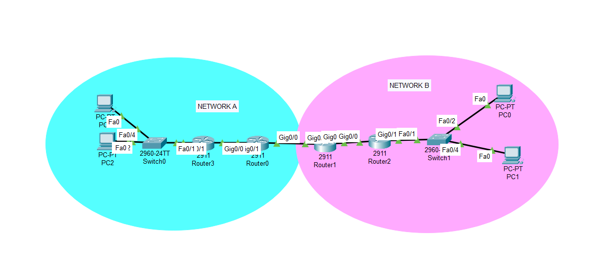

# Multi-Site Enterprise Routing Lab (BGP, EIGRP, DHCP & VLANs)

## 📌 Purpose
Simulates a multi-site enterprise network to practice connecting interior routing protocols, border gateway routing, VLAN segmentation, and automated IP allocation.

## 🏗️ Topology Architecture
The topology connects two network zones via Cisco 2911 routers and Catalyst 2960 switches.

* **Interior Routing (EIGRP):** Uses a shared EIGRP process ID (AS 100) to enable local routers to exchange routes and maintain connectivity within the interior network.
* **Exterior Routing (BGP):** Establishes BGP peer connections between core boundary routers for inter-domain communication across different autonomous systems.
* **VLAN Segmentation:** Implements Layer 2 access ports and trunking (`802.1Q`) linked to router subinterfaces to separate traffic into different departments (such as IT and Finance).
* **Dynamic Addressing:** Configures router-based DHCP pools to automatically assign IP addresses to end-devices.

## 💡 Key Learnings
* **Protocol Redistribution:** Bridging EIGRP and BGP routing domains so different routing protocols can share path information.
* **Router-on-a-Stick:** Configuring multiple subinterfaces on a single physical router port to route traffic between distinct VLANs.
* **DHCP Management:** Setting up IP address pools and configuring excluded ranges to prevent duplicate IP conflicts with default gateways.
* **Network Verification:** Using CLI diagnostic commands to verify link states, routing tables, and end-to-end connectivity.
